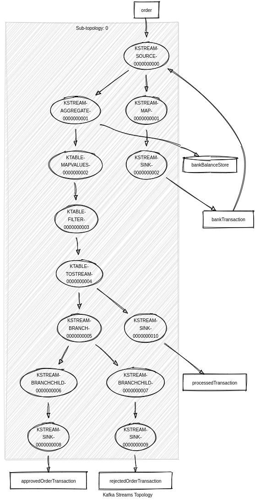

### Запуск приложения

#### Запуск сервисов kafka

```shell
kubectl create namespace abdalovalex-l8-kafka && helm install kafka-service helm/kafka --namespace abdalovalex-l8-kafka
```

#### Запуск сервиса "Заказ"

```shell
kubectl create namespace abdalovalex-l8-order-service && helm install order-service helm/order-service --namespace abdalovalex-l8-order-service
```

#### Запуск сервиса "Уведомлений"

```shell
kubectl create namespace abdalovalex-l8-notification-service && helm install notification-service helm/notification-service --namespace abdalovalex-l8-notification-service
```

#### Запуск сервиса "Биллинг"

```shell
kubectl create namespace abdalovalex-l8-billing-service && helm install billing-service helm/billing-service --namespace abdalovalex-l8-billing-service
```

1. До установки запускаются следующие ресурсы:
    1. Запуск БД
    2. Установка ConfigMap и Secret
2. Запуск Deployment

Для порядка запуска используются initContainer и helm hook.  
ConfigMap и Secret забирает приложение(инструмент SpringCloudKubernetes), для этого создан ServiceAccount
с ограниченными ролями для приложения.

### Запуск тестов

```shell
newman run ./tests/tests.json
```

```
newman

otus_l8

→ Добавить счет
  POST http://arch.homework/billing-service/account/create [201 Created, 104B, 360ms]
  ✓  Добавить счет

→ Добавить уже существующий счет (идемпотентность)
  POST http://arch.homework/billing-service/account/create [400 Bad Request, 200B, 49ms]
  ✓  Добавить уже существующий счет (идемпотентность)

→ Положить деньги на счет
  PATCH http://arch.homework/billing-service/account/put [200 OK, 99B, 476ms]
  ✓  Положить деньги на счет

→ Положить деньги на счет (идемпотентность)
  PATCH http://arch.homework/billing-service/account/put [400 Bad Request, 223B, 10ms]
  ✓  Положить деньги на счет (идемпотентность)

→ Получить баланс
  GET http://arch.homework/billing-service/account/64043603 [200 OK, 298B, 36ms]
  ✓  Получить баланс

→ Создать заказ 1
  POST http://arch.homework/order-service/order/create [201 Created, 146B, 14ms]
  ✓  Создать заказ 1

→ Создать заказ 1 (идемпотентность)
  POST http://arch.homework/order-service/order/create [400 Bad Request, 209B, 8ms]
  ✓  Создать заказ 1 (идемпотентность)

→ Получить баланс
  GET http://arch.homework/billing-service/account/64043603 [200 OK, 293B, 11ms]
  ✓  Получить баланс

→ Получить письмо по заказу 1
  GET http://arch.homework/notification-service/notification/5 [200 OK, 178B, 8ms]
  ✓  Получить письмо по заказу 1

→ Создать заказ 2
  POST http://arch.homework/order-service/order/create [201 Created, 146B, 16ms]
  ✓  Создать заказ 2

→ Получить баланс
  GET http://arch.homework/billing-service/account/64043603 [200 OK, 293B, 10ms]
  ✓  Получить баланс

→ Получить письмо по заказу 2
  GET http://arch.homework/notification-service/notification/6 [200 OK, 221B, 6ms]
  ✓  Получить письмо по заказу 2

┌─────────────────────────┬───────────────────┬───────────────────┐
│                         │          executed │            failed │
├─────────────────────────┼───────────────────┼───────────────────┤
│              iterations │                 1 │                 0 │
├─────────────────────────┼───────────────────┼───────────────────┤
│                requests │                12 │                 0 │
├─────────────────────────┼───────────────────┼───────────────────┤
│            test-scripts │                24 │                 0 │
├─────────────────────────┼───────────────────┼───────────────────┤
│      prerequest-scripts │                21 │                 0 │
├─────────────────────────┼───────────────────┼───────────────────┤
│              assertions │                12 │                 0 │
├─────────────────────────┴───────────────────┴───────────────────┤
│ total run duration: 5.2s                                        │
├─────────────────────────────────────────────────────────────────┤
│ total data received: 770B (approx)                              │
├─────────────────────────────────────────────────────────────────┤
│ average response time: 83ms [min: 6ms, max: 476ms, s.d.: 151ms] │

```

### Удаление

#### Kafka

```shell
helm uninstall kafka -n abdalovalex-l8-kafka  
kubectl delete namespace abdalovalex-l8-kafka 
````

#### Удалить сервис "Заказ"

```shell
helm uninstall order-service -n abdalovalex-l8-order-service  
kubectl delete namespace abdalovalex-l8-order-service
kubectl delete clusterrolebinding order-service
kubectl delete clusterrole order-service 
````

#### Удалить сервис "Уведомлений"

```shell
helm uninstall notification-service -n abdalovalex-l8-notification-service
kubectl delete namespace abdalovalex-l8-notification-service
kubectl delete clusterrolebinding notification-service
kubectl delete clusterrole notification-service
```

#### Удалить сервис "Биллинг"

```shell
helm uninstall billing-service -n abdalovalex-l8-billing-service
kubectl delete namespace abdalovalex-l8-billing-service
kubectl delete clusterrolebinding billing-service
kubectl delete clusterrole billing-service
```

### Архитектурное решение

Решение основано на kafka streams.


1. Создается заказ
2. Заказ попадает в топик "order"
3. Сервис биллинга, считывает топик "order" и перенаправляет в топик bankTransaction
4. Далее обрабатывается топик bankTransaction, в котором происходит агрегация банковских
   операций, для вычисления баланса. И сохраняется в хранилище bankBalanceStore(kafka)
5. Затем из потока вытаскиваются, только банковские операции, которые относятся к заказам.
   И перенаправляются в топик approvedOrderTransaction для успешных операций или rejectedOrderTransaction
   для неуспешных
6. Сервис уведомлений считывает топик approvedOrderTransaction для отправки успешных уведомлений
   и топик rejectedOrderTransaction для неуспешных уведомлений

Для получения баланса, делается запрос в хранилище bankBalanceStore(kafka).
